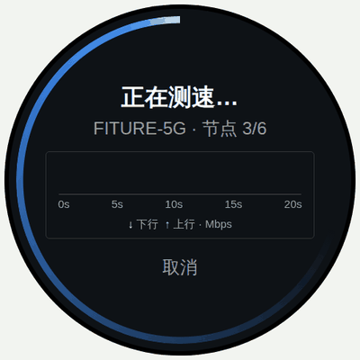
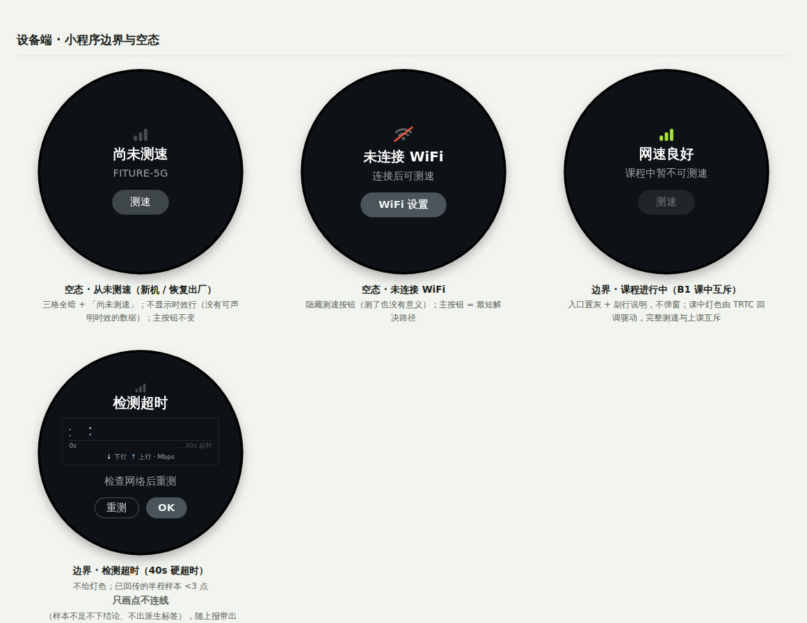
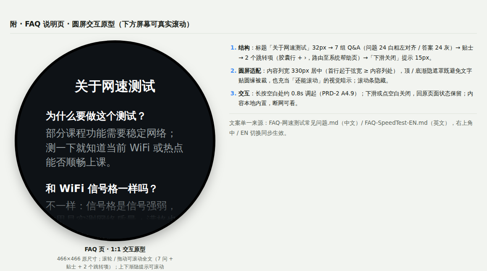
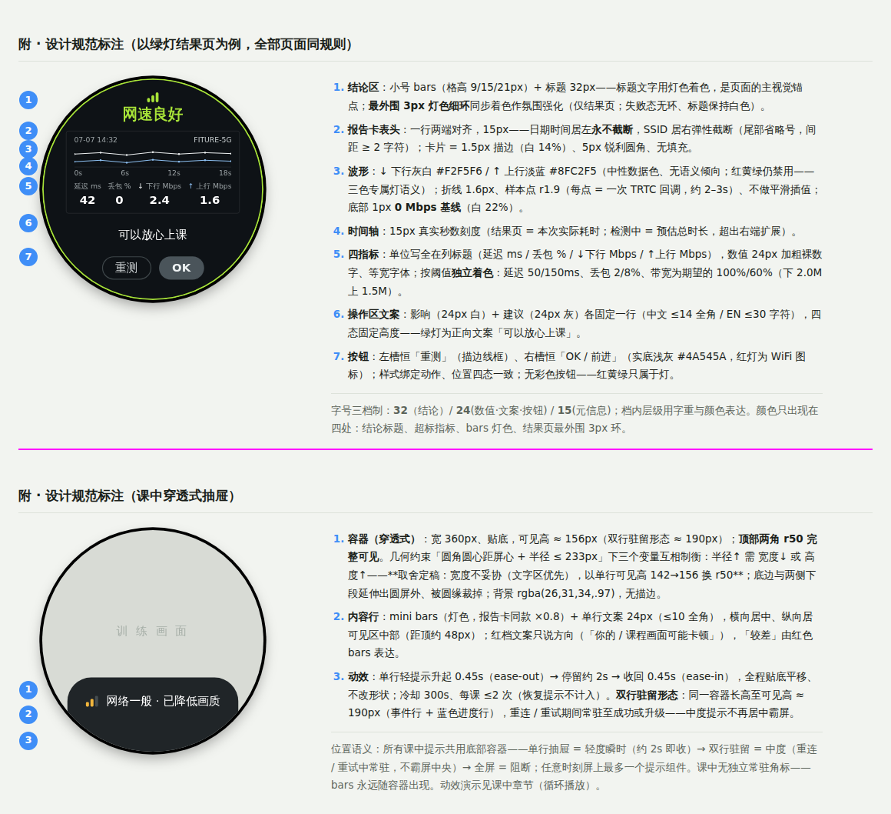

# PRD-2 · 网速测试小程序

| 项 | 内容 |
| --- | --- |
| 版本 | V1.2（定稿：波形淡蓝配色 / 逐点刷新动画 / 结果页 3px 外环 / 边界与空态补全） |
| 范围 | 设备端网速测试小程序全部六态（原模块 A 的 A4）|
| 前置阅读 | [`PRD-atom网络状态检测与信号同步.md`](./PRD-atom网络状态检测与信号同步.md)（三态定义 / **检测逻辑模块 B：数据源、调度、TRTC 测速实现、阈值防抖、上报**——本 App 是模块 B 的主要消费方，测速实现细节全部在 B3） |
| 配套代码 | [`参考代码-网络检测状态机.c`](./参考代码-网络检测状态机.c) · [`参考代码-后端服务.py`](./参考代码-后端服务.py) |

## 状态机与六态设计（原 A4）

**状态机**：首页 →「测速」→ 检测中（可取消）→ 按官方 `quality` 进入绿 / 黄 / 红结果页；失败 → 失败态。结果页「重测」直接回到检测中。

- **A4.1 首页 = 纯入口（测速前）**：灯色 bars + 一句话结论 + **当前 Wi-Fi 名（SSID）** + 副行数据时效（「刚刚更新」≤60 秒 /「N 分钟前测」≤5 分钟）+ 主按钮「测速」。SSID 必须外显——用户点进来看「网好不好」时往往不知道自己连的是哪个 WiFi，灯色结论必须挂在具体网络名下才可归因（与 B2 按 SSID 缓存一致）。**不展示任何数字指标**——常驻探测没有真实带宽，数字只在测速后出现，「测速前 = 入口、测速后 = 报告」天然可区分；缓存超 5 分钟不显示旧灯色，直接「检测中…」并刷新；
- **A4.2 检测中**：标题「正在测速…」+ 副行「Wi-Fi: {SSID} · 节点 N / M」（按官方回调驱动，不做假进度）+ 报告卡内波形实时生长（↓ 灰白 = 下行、↑ 淡蓝 = 上行，见 A4.7）+「取消」（调用 `stopSpeedTest`）；按钮防重入（官方限制同一时间仅一个测速任务）；**刷新动画**：每个新样本到达时——新线段从上一点向新点画入 0.35s（ease）、新点处一次光晕脉冲约 0.4s（r2→r9 淡出）、进度虚线游标跳至最新点；动画只装饰「新增」这一瞬间，点与线的数据本身不插值不平滑（假动画禁令不变，见 A4.7）；
- **A4.3 结果页信息分组（四组，组间距 > 组内距）**：① 结论（bars + 一句话，**标题文字直接用灯色着色**——绿「网速良好」/ 黄「网速一般」/ 红「网速较慢」，四态位置与字号完全一致；结论标题是主视觉锚点：位置最高、字号最大、语义即结论；V1.2 起结果页在**屏幕最外围加 3px 灯色细环**与结论同色作氛围强化——与被否掉的 10px 粗色环不同，3px 不挤压排版、不与进度环混淆（宽度差 3 倍以上），主视觉仍是结论标题；试过 2px，评审定 3px（更醒目，定稿）；失败态标题保持白色、无外环——没测出来不给灯色）→ ② **报告卡**，卡内自上而下：**表头一行、两端对齐——日期时间居左（完整显示优先，永不截断）、SSID 居右（弹性宽度，超宽尾部省略号，与日期至少保留 2 字符间距）**，不加「Wi-Fi:」前缀（上下文已明确，标签属冗余；带日期是为了反馈截图能和后端日志对上，方便 debug）→ 波形定格 + 时间轴（表头合并为一行省出的高度给了**波形增高**与**分隔线下方的操作区行距**；曲线纵轴 = 上下行带宽，检测中页无指标列，单位并入图例行「↓ 下行 ↑ 上行 · Mbps」）→ 四指标一行：**单位写全并入列标题**——「延迟 ms / 丢包 % / ↓ 下行 Mbps / ↑ 上行 Mbps」（EN：Ping ms / Loss % / Down / Up），数值为裸数字大字。**决策记录**：早期稿用「2.4 M」缩写被质疑单位不明——M 即 Mbps，应写全；但写在每个数字后（2.4 Mbps）会把数值挤小或超宽，单位写进列标题则每列只写一次、数字保持醒目，且表头右侧的 Mbps 角标随之取消（单位单一来源，不再两处标注）。**标签在上、数值在下**（对比过数值在上的方案：标签在上阅读顺序自然「先知道是什么再看多少」、↓↑ 箭头更靠近它解释的曲线、卡片底边收在加粗数值上更稳，与 Ookla 等主流测速工具一致；标签带曲线同色箭头；-1 显示「—」；着色标准见下表）→ ③ 影响 + 建议（绿灯影响行 = 正向一句「可以放心上课」，黄 / 红 = 风险提示；**影响与建议一律白 / 灰、不着色**——结论标题已带灯色，引导文案再着色就花了，颜色只留给「结论」和「超标指标」两处；**各固定一行，字数预算：中文 ≤ 14 全角、EN ≤ 30 字符**——这两处是我们自己维护的固定文案集而非动态内容，靠文案表管控长度即可；**不采用跑马灯**：滚动文字在 1–2 米观看距离难读，且截图会截到半句话，破坏「截图即报告」）→ ④ 操作：**双按钮左右排列**（替代上下堆叠：节省约一行高度，页面更舒缓，也更符合圆屏底部的横向空间），槽位与样式规则见 A4.4——左槽恒「重测」、右槽恒「OK / 前进」，主次靠实底 / 描边表达。**影响 / 建议 + 按钮组成固定高度的操作区，主 / 次按钮的位置在绿 / 黄 / 红 / 失败四态间完全一致**——重测循环里按钮不位移，防误触、建立肌肉记忆。**决策记录**：对比过「按钮沉底 + 报告卡在剩余空间垂直居中」的动态布局——被否，动态居中会让绿灯与黄 / 红灯的报告卡处在不同高度，状态切换跳动、两张截图对不齐；改为绿灯操作区补一句正向文案，空间用满且布局全态一致。**一张报告卡 = 一份完整测速报告，截图即可反馈客服**（截图给人看，上报给系统看）。稳定性派生标签：样本方差超阈值时卡下方显示「网络波动较大」。

  **指标着色标准**（阈值与模块 B4 同源、OTA 可调；数值默认白色，超阈值才变色）：

  | 指标 | 默认（白） | 黄 | 红 |
  | --- | --- | --- | --- |
  | 延迟 RTT | ≤ 50 ms | 50–150 ms | > 150 ms |
  | 丢包率 | < 2% | 2–8% | > 8% |
  | ↓ 下行 | ≥ 期望 2.0 Mbps | 期望的 60–100%（1.2–2.0M） | < 60%（< 1.2M） |
  | ↑ 上行 | ≥ 期望 1.5 Mbps | 期望的 60–100%（0.9–1.5M） | < 60%（< 0.9M） |

  每个指标**独立**按自己的阈值着色；整页灯色结论仍以 TRTC `quality` 为准，两者允许不一致（如整体黄灯但上行单项标红）——着色的作用是让用户一眼看出**卡在哪一项**；
- **A4.4 按钮逻辑（位置恒定 + 主按钮 = 最短解决路径）**：**位置语义固定——左槽恒为「重测」，右槽恒为「OK / 前进」类动作**；**样式绑定动作而非主次——「重测」恒描边线框，「OK / WiFi 图标」恒实底浅灰**：同一动作在任何状态下长相一致，跨状态零学习成本（曾按「本状态主按钮」切换实底/描边，被否——同一个重测按钮时实时虚，反而制造困惑）。不使用高亮绿等强调色：本页动作都是中性操作，没有强 call-to-action 语义，且绿色按钮会与「绿灯」状态语义混淆，绿色只属于灯。「完成」统一改为「OK」（更短，中英文同形）；红灯右槽为 **WiFi 扇形图标按钮**（图标即「去 WiFi 设置」语义，省文字且宽度可控）：

| 状态 | 左槽（恒 = 重测，描边） | 右槽（恒 = OK / 前进，实底） | 推荐动作（语义） | 理由 |
| --- | --- | --- | --- | --- |
| 首页 | — | 测速（单按钮居中，实底） | 测速 | 本页唯一动作 |
| 检测中 | — | 取消（单按钮居中，文字） | — | 等待可中止 |
| 结果 · 绿 | 重测 | OK | OK | 没问题最短路径是离开；存疑可就地复测 |
| 结果 · 黄 | 重测 | OK | 重测（建议是软动作，做完就地验证） | 暂停下载后重测 |
| 结果 · 红 | 重测 | WiFi 图标 | 去 WiFi 设置 | 建议是硬动作（换网 / 挪设备）；什么都不改就重测结果不会变 |
| 失败态 | 重测 | OK | 重测 | 任务未完成，重试是唯一有效动作 |

- **A4.5 失败态**：`success = false` 时**不给任何灯色**（没测出来 ≠ 网络差），「检测未完成 / 检查网络后重试」；`errMsg` 仅上报不上屏；
- **A4.6 历史与精简**：结果本地存近 10 次（按 SSID 分组）并上报；小程序内「历史记录」次级入口（P2）；各页面移除顶部时钟（与检测任务无关的信息不上屏）；
- **A4.7 波形图规范（时间密度 · 实时刷新 · 配色）**：
  - **配色**：↓ 下行 = 灰白 `#F2F5F6`、↑ 上行 = 淡蓝 `#8FC2F5`，图例与指标标签带同色箭头（箭头 ↓↑ + 下行在前是唯一通用的行业惯例，颜色各家自定）。曲线**禁用红 / 黄 / 绿**——三色已被红绿灯语义占用，曲线用灯色会造成「上行 = 绿灯」的误读。**决策记录**：V1.0 上行用紫 `#A78BFA`；V1.2 评审提出品牌一致性，试过品牌淡绿（#B7DF6A）但与灯色绿同族、仍带「上行 = 好」的语义倾向，最终定**中性淡蓝**——无灯色倾向、与进度/重试的信息蓝同族，语义为「数据/过程」（CVD 区分度 ΔE≈33，达标）；
  - **细线框卡片**：报告区（表头 + 波形 + 时间轴 + 四指标）用 **1.5px 细描边圆角框**（白 14% 不透明度、圆角 5px——锐利小圆角，与全圆的屏幕和胶囊按钮形成对比，报告卡更像一张"单据"）整体包住，无填充底色。**决策记录**：对比过三版——①整块浅色填充底（早期，显碎、份量重，否）；②无框仅下分隔线（中期，干净但卡片边界只是隐含的）；③细描边框（采纳）：让「一张报告卡」有可见边界，截图即报告的卡片感更强，且描边无填充、不占视觉份量；
  - **0 Mbps 基线**：波形底部画一条 1px 基准线（白 22% 不透明度，位于秒数刻度行之上）——曲线悬空没有参照系时「离底多高」无从判断，基线 = 0 Mbps 给曲线一个地板，也顺势充当 x 轴线；
  - **笔触**：折线线宽约 1.5px、样本点 r ≈ 2px、最新点 r ≈ 3px——466 圆屏物理尺寸小，线过粗会显粗糙；
  - **屏缘环两种用法，靠宽度区分**：检测中 = 旋转进度环（宽约 10px，蓝）；结果页 = **静止 3px 灯色细环**（与结论标题同色；仅绿 / 黄 / 红结果页，首页与失败态无环）。**决策记录**：V1.0 曾整体取消状态色环——10px 粗环与「bars + 标题 + 指标着色」冗余、视觉份量过重、挤压顶排元素；V1.2 以细环回归并定稿 3px（2px 试过偏弱，3px 更醒目仍不碰排版）：粗细 3 倍以上的差异让「粗环旋转 = 测速中 / 细环静止 = 结果灯色」两条语义互不混淆；
  - **时长逻辑（非固定，Demo 的 18s / 20s 仅为示例值）**：总时长 = 延迟丢包阶段（约 5 秒）+ 带宽阶段，主要由**测速节点数**（`totalCount`，服务端下发、非我们指定）和网络状况决定，典型 **10–30 秒**。注意方向性：**网快不会明显更快**（时长下限由节点调度节奏决定），**网差会拖长**（等待、重试、丢包补偿）——所以进度环按 `finishedCount / totalCount` 驱动而不是按时间，永远真实；**硬超时 40 秒**：超时调用 `stopSpeedTest` 进失败态，文案「检测超时 / 检查网络后重测」。备选文件测速路径时长反而可控：固定时间窗（下行 8s + 上行 8s + ping ≈ 2s，共约 18 秒恒定），这是自研路径的一个优点；
  - **时间密度**：一个样本点 = 一次 TRTC `onSpeedTestResult` 进度回调（按「完成一个测速节点」触发），**间隔不固定**——典型 2–3 秒一点、共约 5–8 点，弱网 / 重试下会拉长；**点按实际到达时刻落在时间轴上**，间距不均匀本身就是信息（能读出「哪一段变慢了」），不做等距归一化。备选文件测速路径按 1 秒一个吞吐量桶采样（约 15–30 点，等距）。点即真实样本，**只画折线不做平滑插值**（不虚构数据），且**每个样本位置画一个小圆点**（r ≈ 2px）——点标出「哪一刻真的回传过数据」，线只负责连接；
  - **实时刷新**：检测中每收到一个回调就在曲线右端追加一点（可 300ms 缓动画入），**最新一点放大显示**（r ≈ 4px，标记「刚回传」），x 轴 = 已用时长，**检测中用预估总时长定标**（初始 20 秒 = `totalCount` × 近期平均每节点耗时；实际超出预估时轴右端整体扩展并重划刻度，曲线不打断），虚线游标标记当前进度；**结果页 x 轴 = 本次实际耗时**（如实际 14 秒就标到 14s，不凑整到假的 18s）；**波形下沿标注时间轴：4–5 个真实秒数刻度**（示例：结果页 `0s / 6s / 12s / 18s`，检测中 `0s / 5s / 10s / 15s / 20s`），采样点落在刻度尺上，用户能读出「掉速发生在第几秒」。**决策记录**：逐点标秒数太挤（5–8 点 × 每标签约 24px，330px 宽放不下且噪）；只写「每点 ≈ 2–3 秒」信息量不足（读不出事件位置）；均匀秒数刻度两者兼顾——采样间隔属工程参数，写在本 PRD 与上报字段里，不上屏；回调间隔内数值不做假动画。带宽值在延迟阶段尚无效（-1），曲线从首个有效带宽样本开始画；
  - **数值口径（波形 = 过程，四指标 = 结论）**：结果页四个数字取 **SDK 最终回调的整体聚合值**——`rtt` / `lossRate` / `availableUp(Down)Bandwidth` 由官方在整次测速结束时汇总输出，**我们不对波形逐点自行求平均**（丢包取上下行较大值 ×100%，见总览 B3 映射表）；波形负责展示过程（含掉速时刻），指标负责给结论，两者数据源一致但口径不同。备选文件测速路径：上/下行 = 各自测试窗内的平均吞吐，ping = 多次采样取中位数；样本方差超阈值时由「网络波动较大」派生标签提示（见 A4.3）；
  - **定格复用**：测速结束波形数据原样冻结进结果页报告卡（同一份数据、同一组件），不重绘不重采样；
  - **字号三档制**（466px 屏基准，**全小程序只用 3 个字号**）：**大 32 = 结论标题**（每页唯一）；**中 24 = 指标数值、影响、建议、按钮、副行文案（节点进度 / 取消 / 首页时效）**；**小 15 = SSID、日期时间、指标列标题、时间轴刻度、图例**。档内层级不靠字号、靠**字重与颜色**：数值 = 中号加粗（白或阈值色）、影响 = 中号白、建议 = 中号灰、SSID = 小号浅白、其余小号灰。演进记录：V1.0 中期一度用到 7 个字号（32/24/22/17/15/14/13），已收敛为三档。结果页顶部 bars 用小号字形（格高 9/15/21px）并预留顶部安全边距——顶排元素离表圈最近，宁小勿裁；组间距大于组内距，宁可留白也不顶到表圈。
- **A4.8 边界 · 空态 · 显示保护**（Demo 有专门的「边界与空态」一节：从未测速 / 未连接 WiFi / 课程中置灰 / 检测超时四屏，另失败态屏含超长 SSID 截断示例）：

| 场景 | 处理 |
| --- | --- |
| **超长 SSID**（中文 / emoji / 32 字节长名） | 表头一行两端对齐：日期时间居左**永不截断**，SSID 居右弹性截断（尾部省略号，与日期至少留 2 字符间距）；首页 / 检测中 / WiFi 列表行同规则 |
| 隐藏 SSID / 名称为空 | 显示占位「已连接网络」 |
| **从未测过速**（新机 / 恢复出厂） | 首页三格全暗 +「尚未测速」，不显示时效行；主按钮「测速」不变 |
| **未连接 WiFi 进入小程序** | 「未连接 WiFi」+ 主按钮「WiFi 设置」，隐藏测速按钮（测了也没有意义） |
| **课程进行中**（B1 课中互斥） | 测速入口置灰 + 副行「课程中暂不可测速」；不弹窗 |
| 测速中 WiFi 断开 / 切换网络 | 立即取消任务进失败态，副行注明「网络已断开 / 已切换网络」；切换后按 B2 清缓存重新探测 |
| **测速超时**（> 40 秒未完成） | 调用 `stopSpeedTest` 进失败态，「检测超时 / 检查网络后重测」；已回传的样本随上报带出（半份数据对排查也有价值） |
| 带宽返回 -1（官方无效值） | 指标显示「—」，不着色、不参与波形 |
| 延迟极端值 | > 999 ms 显示「999+ ms」；丢包封顶 100% |
| 大带宽数值 | < 10 Mbps 保留 1 位小数，≥ 10 Mbps 取整（如「88」，单位在列标题）；四指标用等宽数字（tabular figures），刷新不跳动 |
| 波形样本 < 3 点（提前中断 / 极端快） | 只画采样点不连线；不出「网络波动较大」派生标签（样本不足不下结论） |
| 设备时钟未同步 | 表头时间显示「时间未同步」，上报侧改用相对时间戳，避免假日期误导 debug |
| **测速中退出小程序 / 息屏** | 立即调 `stopSpeedTest` 取消任务（后台不继续消耗带宽），再次进入回首页缓存态 |
| **测速中课程开始**（预约课自动进课） | 课中互斥优先：立即取消测速，进课不被阻塞；已回传半程样本随上报带出 |

- **A4.9 隐藏说明入口（长按背景 → FAQ）**：小程序内**任意页面长按非按钮 / 非报告卡交互区的背景约 0.8s**（+ 轻震动反馈）弹出全屏 FAQ 页「关于网速测试」，回答「为什么产品要自带网络测试」「和自己用测速软件有什么区别」等困惑（文案单一来源：中文 [`FAQ-网速测试常见问题.md`](./FAQ-网速测试常见问题.md) / 英文 [`FAQ-SpeedTest-EN.md`](./FAQ-SpeedTest-EN.md)，含屏上精简版字数预算；**隐私口径保守**——不描述数据流向与内容，上/下行仅解释为发送 / 接收速度）。交互规则：
  - **形态**：全屏页（用户主动调起，不算打扰）——标题「关于网速测试」32px + 可滚动 Q&A 列表（问题 24 白加粗 / 答案 24 灰，答案 ≤3 行）；下滑或点空白关闭，**返回原页面且状态保留**（测速中长按不中断任务，FAQ 关闭后回到进行中的测速页）；
  - **为什么用隐藏入口**：说明属低频需求，不占常驻 UI（六态页面寸土寸金）；**首次进入小程序在底部一次性提示「长按空白处可查看说明」**（仅提示一次，本地记录）；失败态与客服话术中也可引导长按；
  - **页底跳转项**：FAQ 列表末尾固定两个跳转入口——「怎么连接手机热点」「怎么开启最大兼容」→ 系统帮助页（路由由客户端配置；配合 Q6「信号差建议连手机 5G 热点」的引导闭环）；
  

  - **边界**：长按判定与滚动 / 点按手势互斥（位移超阈值即取消）；按钮、波形卡、历史列表等可交互区域内长按不触发（避免误出）；FAQ 页内容静态本地内置，无网络依赖（断网也能看——断网场景恰恰是最需要它的时刻；两个跳转项目标为系统页，同样离线可达）。

**结果页设计规范标注**（七个分区的字号 / 颜色 / 规则速查；下半部分为课中穿透式抽屉规范，属 PRD-3 范围，同图收录；完整交互见 Demo 附录）：

---

