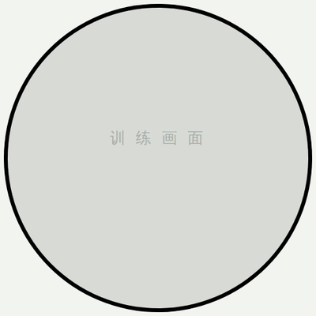

# PRD-3 · 课中双端提示（模块 C）

| 项 | 内容 |
| --- | --- |
| 版本 | V0.9（设计中——基于现状代码 `weak_network_manager.c` 的改造方案） |
| 范围 | ATOM 设备端课中提示（抽屉[单行瞬时 / 双行驻留] / 中断页）· 存量弹窗收敛 · 带宽保护 · 手机 App 课中 · 启动加载页 |
| 前置阅读 | [`PRD-atom网络状态检测与信号同步.md`](./PRD-atom网络状态检测与信号同步.md)（三态定义 / 模块 B 检测逻辑 / 文案总表） |
| 现状代码 | [`backup/现状代码-weak_network_manager.c`](./backup/现状代码-weak_network_manager.c)（2026-07 快照，本文 §1 逐条解读） |
| 改造参考实现 | [`参考代码-课中提示状态机.c`](./参考代码-课中提示状态机.c)——保留原符号与重放机制的三级响应重写，可对照 diff |

> 核心原则（已拉齐）：**除非真的断了，不打断用户**；识别的实时性优先于一切后台任务；重试是机器的活，不是用户的。


---

## 1. 现状机制解读（weak_network_manager.c）

一个单例管理器，**两条触发链路共用同一个阻断式 overlay**，外加一条断线链路：

```
HTTP 链路   http_execute_request_with_retry() 内部重试 3 次仍超时
            → notify_timeout()：保存请求上下文（mtype/param/原始callback）→ 弹 overlay
            → 用户点「重试」→ 请求重新入队（callback 换成内部重试回调）
              ├─ 成功/其他错误 → 收起 overlay，回放原始 callback
              ├─ 仍超时 ×2    → 跳「弱网页」PAGE_WIFI_POOR_CONNECTION
              └─ 断网         → 跳「弱网页」

TRTC 链路   onNetworkQuality（约 2s 一跳）
            → quality ≥ 4 连续 2 跳（≈4s）→ 弹 overlay
            → 用户点「重试」→ 仅收起 + 冷却 8 跳（≈16s），没有任何重试动作
              └─ 冷却后仍弱 → 第 2 次 overlay → 再冷却仍弱 → 跳「断网页」PAGE_WIFI_NOT_CONNECT
            → quality ≤ 2 连续 3 跳 → 自动收起（仅限 TRTC 触发的 overlay）
            → quality = 3（POOR）/ 0（UNKNOWN）→ 中间态：好坏两个计数器都清零

断线链路   onDisconnected ×1 → 直接跳「断网页」；onConnected → 全量复位 + 收起
```

### 1.1 中断界面清单（3 个，全部为阻断级）


| # | 界面（代码符号） | 形态 | 入口 | 用户操作 | 去向 |
| --- | --- | --- | --- | --- | --- |
| ① | `weak_network_overlay` | 弹窗，遮挡训练画面 | HTTP 超时（重试 3 次后）；TRTC quality≥4 ×2 跳——**两条链路共用，文案相同** | 重试（HTTP=重放请求 / TRTC=假动作）· 返回（回 `s_pre_page`） | 见跳转图 |
| ② | `PAGE_WIFI_POOR_CONNECTION` | 整页，**课程被退出** | HTTP 手动重试 2 次耗尽；HTTP 检测到断网 | 去 WiFi 设置 | 离开课程 |
| ③ | `PAGE_WIFI_NOT_CONNECT` | 整页，课程被退出 | TRTC `onDisconnected` ×1；**TRTC 弱网假重试耗尽（⚠ 归因错误）** | 去 WiFi 设置 | 离开课程 |

> 图中弹窗布局按用户提供的实机截图复原，两个整页为按页面名推测的示意；按钮与跳转关系全部为 manager 代码实证。**三个界面没有非阻断形态**——这正是 §2 三级响应要补的层。

### 1.2 写得好的部分（全部保留）

| 机制 | 代码位置 | 与新方案的关系 |
| --- | --- | --- |
| 双向滞回防抖（2 坏才触发 / 3 好才恢复） | `TRTC_WEAK_TRIGGER_COUNT` / `TRTC_GOOD_RECOVER_COUNT` | 防抖思想直接沿用，只调参数 |
| 触发后冷却期（8 跳 ≈ 16s） | `trtc_retry_cooldown` | 「防提示轰炸」的雏形，升级为抽屉冷却 300s |
| 幂等保护（已显示则忽略） | `is_showing` 检查 | 保留 |
| HTTP 请求上下文保存 + 重放 | `pending_ctx` + `weak_network_on_retry_clicked` | **静默自动重试直接复用这套机制**，只是发起方从用户变成系统 |
| 断线恢复全量复位、pre_page 返回 | `notify_trtc_connected` / `s_pre_page` | 保留 |
| UI 线程边界清晰 | `lv_async_call` 全覆盖 | 保留 |

### 1.3 问题清单（与原则逐条对照）

| # | 问题 | 代码证据 | 违反的原则 |
| --- | --- | --- | --- |
| P1 | **弱网被当成断网级事件**：quality≥4 连续 2 跳（约 4 秒）就弹全屏 overlay 盖住训练画面 | `notify_trtc_quality` 弱网分支 | 弱网 ≠ 断网；课中不打断 |
| P2 | **TRTC 的「重试」是假动作**：点击只做「收起 + 冷却」，没有任何重试实体；且要求正在训练的用户触屏 | `weak_network_trtc_retry_clicked` 注释自述 | 重试是机器的活；零操作 |
| P3 | **弱网耗尽跳「断网页」**：网络明明连着只是慢，用户被引导去查连接，查不出任何问题 | retry 耗尽走 `goto_wifi_no_connection_cb` | 可归因——报错必须指对方向 |
| P4 | **POOR(3) 是中立区且无黄档**：质量在 3↔4 抖动时既永不触发也永不恢复（两计数器互相清零）；整个体系只有「弱 / 不弱」二值，没有「一般，已降级」这一档 | `else` 中间态分支 | 三态灯语义；黄 = 可上但可能偶卡 |
| P5 | **单通道 quality**：未区分 local/remote → 无方向归因（分不清「你的画面卡」还是「课程画面卡」） | `notify_trtc_quality(int quality)` 签名 | 位置即归因 |
| P6 | **HTTP 超时一律弹窗**：不区分请求关键性——打点 / 上报类后台请求失败也打断上课 | `notify_timeout` 对所有 mtype 一视同仁 | 不为后台任务打扰前台 |
| P7 | **每节课无提示总量上限**：恢复时冷却清零，一节课可反复弹 overlay | 恢复分支 `trtc_retry_cooldown = 0` | 抽屉 ≤2 次/课 |
| P8 | **两条链路共用同一 overlay 文案**（「网络连接不稳定，请重试」）：接口超时和音视频链路差呈现无差别 | 共用 `weak_network_overlay_show` | 文案四段式：说清发生了什么 |
| P9 | 6 行复位代码在 5 处重复散落（工程健康，顺手修） | 各分支 | — |

---

## 2. 目标设计：两组件（抽屉双形态 + 中断页）· 三级响应

**组件模型（定稿）**：课中提示只有**两个 UI 组件**（抽屉、全屏中断页），抽屉有单行 / 双行两种形态，对应三个打扰级别——**组件形态 = 打扰级别，信息 = 内容参数**——同一组件复用于不同消息，用户看到组件形态就知道该不该动手：

| 组件 | 打扰级别 | 形态特征 | 承载内容（实例） | 出口 |
| --- | --- | --- | --- | --- |
| **抽屉 · 单行**（轻度） | 非阻断 | **从底缘升起 → 停留约 2s → 收回**（评审由 3s 收紧：轻提示看一眼即走）、零按钮、冷却 300s + 每课 ≤2 次 | 「网络一般 · 已降低画质」/「你的 / 课程画面可能卡顿」（红 bars 即「网络较差」，文案只说方向）/「网络已恢复」 | 自动收回，无状态 |
| **抽屉 · 双行驻留**（中度） | 非阻断（驻留） | **与单行共用同一底部容器**，长高为双行并**驻留**至恢复——重连 / 重试期间**不霸屏中央**；系统自救中、进度可见（第 N 次）、无按钮、无需操作 | 「网络中断 + ⟳ 自动重连中（第 N 次）…」（画面定格）/「课程数据加载失败 + ⟳ 重试中（1/2）…」（画面继续） | **只有两个**：成功 → 静默收回（+恢复抽屉）；超时/耗尽 → 升级阻断 UI |
| **阻断 UI**（中断页） | 阻断（终态） | 全屏、**自救已失败、轮到用户**；自动重试仍持续可见；唯一按钮「WiFi 设置」 | 「课程已暂停 · WiFi 已断开」/「课程已暂停 · 网络不稳定」（同组件两个归因变体） | **只有一个**：网络恢复 → 自动回课 |

**组件样式规范（466×466 圆屏）**（抽屉的逐项标注图见 [`images/界面-设计规范标注.png`](./images/界面-设计规范标注.png) 下半部分）：

| 组件 | 位置（空间语义） | 结构 | 规格 | 动效与时长 |
| --- | --- | --- | --- | --- |
| 抽屉 · 单行 | **穿透式底部抽屉**：比屏幕大、从屏下拉上来的面板——顶部两角 r50 完整可见（评审由 r40 加大；几何约束「圆角圆心距屏心 + 半径 ≤ 233px」，容器同步由 360 收窄至 330），底边与两侧下段延伸出圆屏外（被圆缘裁掉），贴底 | mini bars（灯色）+ 单行文案，内容行居可见区中部 | 宽 330px、可见高 ≈ 142px；文案 24px、≤10 全角 | 升起 0.45s（ease-out）→ 停留约 2s（1–2s 区间取上限，OTA 可调）→ 收回 0.45s（ease-in）；冷却 300s、≤2 次/课（恢复不计入） |
| 抽屉 · 双行驻留 | **同一底部容器的加高形态**（宽 330px、可见高 ≈ 190px、顶角 r50 穿透式）——中度提示不再居中霸屏 | 第 1 行事件（「网络中断」+ 红 bars /「课程数据加载失败」）+ 第 2 行蓝色进度（「⟳ 自动重连中（第 N 次）…」/「⟳ 重试中（1/2）…」，**有限次数外显**，耗尽即升级） | 两行均 24px、事件行 ≤8 全角；无描边（与抽屉一致），「进行中」由蓝色进度行 + spinner 表达 | 直接双行升起（或单行原位长高）后**驻留**至成功（静默收回 + 恢复抽屉）或超时/耗尽升级；spinner 匀速旋转；断线变体画面定格调暗 50%，数据变体画面继续 |
| 阻断 UI | 全屏 | 归因图标（断网 = 扇形断开 / 弱网 = 红 1 格 bars）→ 标题 32「课程已暂停」→ 归因副行 24 灰 → 重试进度行 24 蓝 → 实底按钮「WiFi 设置」 | 沿用全局三档字号（32/24/15）与按钮规范 | 恢复 → 自动回课 + 恢复抽屉 |



**位置语义（打扰级别的空间表达，V1.2 修订）**：所有课中提示**共用同一个底部容器空间**——**单行抽屉 = 轻度瞬时**（约 2s 即收）→ **双行抽屉 = 中度驻留**（重连 / 重试进行中，常驻但不遮画面中央）→ **全屏 = 阻断**。打扰级别由**驻留时长与容器高度**表达，提示位置不再跳变。**决策记录**：原方案中度用屏幕居中卡——被否：重连可能持续数十秒，居中卡长时间挡在画面中央与「只要还在重试就不打断用户」的原则矛盾；合并进抽屉后，用户建立单一预期「网络的事都在底部」。**课中无独立常驻角标（评审决议）**：网络信号 icon（bars）**永远跟随内容容器出现**——抽屉内（单行 / 双行）、阻断页内；单独挂在画面顶部的状态图标属于常驻噪音，且与「提示即事件」冲突，灯的常驻表达由课前入口（PRD-1/2）承担。

**字号标准（探索结论）**：沿用全局三档（32/24/15），课中只动用两档——**32 仅用于全屏页标题**（阻断 UI「课程已暂停」），**24 用于一切组件内文案、进度行、按钮**；15 元信息层课中无内容。**一致性原则：字号跟随内容层级，不跟随打扰级别**——同一句提示在单行与双行抽屉里字号相同（24），升级感全部由容器高度与驻留时长表达（贴底单行瞬时 → 贴底双行驻留 → 全屏）。若字号随级别放大，同一句文案会出现三种大小，且「大字 = 重要」会与「全屏标题 32」的既有语义打架；中度级别的信息增量靠**加第二行**（进度），不靠加大字号。

**互斥规则**：同一底部容器天然互斥——单行与双行不叠加，双行驻留期间新的轻度事件不另弹（信息并入或忽略）；阻断 UI 显示期间抽屉收回——任意时刻屏上最多一个提示组件。

配套两条硬规则：① **单向升级**——事件只能沿 单行抽屉 → 双行驻留 → 阻断页 变重，绝不反向（用户看到双行驻留就知道"系统在忙"，看到阻断就知道"该我了"）；② **恢复即回落**——任何一级在网络恢复时自动消退，不需要用户确认。课中没有第 0 层常驻角标（评审决议，见上）——无事件时屏上没有任何网络元素。

### 三级响应状态机

弱网提示从「一个 overlay」改为**三级响应**，级别与网络事件的严重度一一对应：

```
                       ┌────────────────────────────────────────────────┐
 onNetworkQuality ──►  │ 抽屉（轻度）  灯色下降沿弹一次：升起→约2s→收回    │  轻提醒
 (worst(local,remote)) │              bars 随抽屉出现，无事件时屏上无网络元素│
                       └────────────────────────────────────────────────┘
 onDisconnected ────►  双行抽屉驻留「网络中断 + 自动重连中…」（画面定格，不霸屏）
      └─ 重连超 30s ►  ┌────────────────────────────────────────────────┐
 关键 HTTP 断网 ─────►  │ Tier 2 · 全屏中断页（唯一阻断样式）              │  阻断
                       └────────────────────────────────────────────────┘
 恢复（任一级）────►    抽屉「网络已恢复」，全量复位
```

- **灯色映射（修 P4）**：quality 1–2 → 绿，3–4 → 黄，5 → 红，6 / onDisconnected → 断线流程；输入改为 `worst(localQuality, remoteQuality)`（修 P5）；
- **抽屉（轻度）**：灯色**下降沿**触发一次（绿→黄、黄→红、绿→红），防抖 3 跳（≈6s，与模块 B 全局一致）确认后才算；方向归因文案（上行差「你的画面可能卡顿」/ 下行差「课程画面可能卡顿」——红 bars 随抽屉即「网络较差」，文案只说方向 / 黄「网络一般 · 已降低画质」）；自动收回、零按钮；**冷却 300s，每节课 ≤2 次**（修 P1/P7）；配短音效（训练中看不到屏，可设置关）；
- **Tier 2 全屏中断页**：仅两个入口——① TRTC `onDisconnected` 且 SDK 自动重连超 30 秒；② 关键 HTTP 请求确认断网 / 静默重试耗尽。四段式文案（标题=发生了什么 / 正文=影响+归因 / 辅助行=「正在自动重连（第 N 次）…」/ 按钮=仅「WiFi 设置」）；**自动重试持续可见，无手动「重试 / OK」按钮**（修 P2）；
- **瞬时抖动（<10s 自愈）**：未过防抖，无任何提示；
- **恢复**：`onConnected` / 灯回绿 → 抽屉「网络已恢复」+ 全量复位。

**优化后形态全览与现状逐入口映射**（弹窗组件整体退役；中断页为同一组件的两个归因变体，课程是「暂停」而非「退出」，恢复自动回课）：


### 2.1 事件 × 响应总表（开发实现与 QA 测试矩阵）

| 事件 | 条件 | 响应 | 打扰级别 |
| --- | --- | --- | --- |
| quality 回 1–2（绿） | 防抖 3 跳 | 若此前红过 / 断过 → 抽屉「网络已恢复」 | 0 / 抽屉 |
| quality 3–4（黄） | 防抖 3 跳，下降沿 | 抽屉「网络一般 · 已降低画质」（限流） | 抽屉 |
| quality 5（红） | 防抖 3 跳，下降沿 | 抽屉方向归因（上行差=你的画面 / 下行差=课程画面，红 bars 随抽屉） | 抽屉 |
| quality 抖动 3↔4 | — | **无提示**（同档内变化无下降沿） | 0 |
| 瞬时抖动 <10s 自愈 | 未过防抖 | 无提示 | 0 |
| `onDisconnected` | 立即 | 双行抽屉升起驻留「网络中断 + 自动重连中…」，画面定格 | 双行驻留 |
| 断线持续 | 驻留超 **30s** | 升级 Tier 2 全屏中断页（**断网归因**，自动重试可见，唯一按钮 WiFi 设置） | 阻断 |
| `onConnected` | 任意 | 收双行驻留 / 中断页 + 单行抽屉「网络已恢复」 | 抽屉 |
| HTTP 可延后请求超时 | 打点 / 上报 / 组间上传 | 静默重试 ≤2 次 → 本地缓存恢复后补传；**永不上屏** | 0 |
| HTTP 关键请求超时 | 进课鉴权 / 课程资源 | 第 1 次静默重试 → 第 2 次双行抽屉驻留「课程数据加载失败 + 重试中…」→ 耗尽 Tier 2（**弱网归因**） | 0→双行驻留→阻断 |
| HTTP 确认断网 | 立即 | Tier 2（断网归因） | 阻断 |
| 抽屉限流 | 全程 | 冷却 300s + 每课 ≤2 次；进课清零配额 | — |

### 2.2 HTTP 请求分级（修 P6）

| 级别 | 例子 | 失败处理 |
| --- | --- | --- |
| **关键**（阻断课程流程） | 进课鉴权、课程资源拉取 | 静默自动重试 1 次（复用 `pending_ctx` 重放）→ 仍失败：断网 → Tier 2；超时 → 双行抽屉驻留「课程数据加载失败 + 重试中…」再试 1 次 → 仍失败 → Tier 2 |
| **可延后**（后台数据） | 打点、进度上报、组间报告上传 | 静默入队重试（上限 2 次），失败本地缓存、恢复后补传；**永不上屏** |

### 2.3 现有代码改造映射（函数级）

| 现有符号 | 处置 | 说明 |
| --- | --- | --- |
| `notify_trtc_quality(int q)` | **改造** | 签名改 `(local, remote)`；不再驱动 overlay，驱动轻度抽屉状态机（课中无独立角标）；三档映射 |
| `TRTC_QUALITY_BAD_THRESH=4` 等宏 | **改造** | 黄 = 3–4，红 = 5；`TRTC_WEAK_TRIGGER_COUNT` 2→3（对齐全局防抖） |
| `trtc_retry_cooldown`（8 跳） | **改造** | 换成 `drawer_last_sec`（300s）+ `drawer_cnt`（≤2/课，进课时清零） |
| `weak_network_trtc_retry_clicked` / `trtc_show_weak_overlay_cb` | **移除** | 假重试删除（P2）；TRTC 弱网不再有 overlay |
| `notify_trtc_disconnected`（1 次即跳断网页） | **改造** | 先双行抽屉驻留「自动重连中…」+ 计时；**超 30s** 才 Tier 2（SDK 有自动重连，别抢跑） |
| `notify_trtc_connected` | **保留+** | 追加「网络已恢复」抽屉 |
| `notify_timeout`（HTTP 超时→overlay） | **改造** | 按 §2.2 分级：可延后请求静默化；关键请求先静默自动重试（复用重放机制），耗尽才 Tier 2 |
| `weak_network_on_retry_clicked` | **改造** | 保留重放实体，触发方从「用户点击」改为「系统定时」 |
| `notify_no_network` | **保留** | 真断网 → Tier 2（断网页），语义本来就对 |
| retry 耗尽跳 `PAGE_WIFI_NOT_CONNECT` | **修复** | 弱网耗尽 → `PAGE_WIFI_POOR_CONNECTION`；只有真断连才去 NOT_CONNECT（P3） |
| 5 处散落的复位块 | **重构** | 提取 `wn_reset_all()`（P9） |
| `is_showing` / `pending_ctx` / `s_pre_page` / `lv_async_call` 模式 | **保留** | 原样沿用 |

新增状态字段：`drawer_cnt`、`drawer_last_sec`（抽屉限流）、`retry_since_sec`（双行驻留起始，判 30s 升级）、进课统一走 `wn_reset_all()` 清零计数（字段名与参考代码一致）。

### 2.4 参数表（旧 → 新，全部进 OTA 配置）

| 参数 | 现值 | 新值 | 理由 |
| --- | --- | --- | --- |
| 弱网触发防抖 | 2 跳（≈4s） | 3 跳（≈6s） | 与模块 B 全局防抖一致；躲过瞬时抖动 |
| 恢复防抖 | 3 跳 | 3 跳（不变） | 现值合理 |
| 提示冷却 | 8 跳 ≈ 16s | 300s | 16s 后再弹仍是轰炸 |
| 每课提示上限 | 无 | 2 次 | 上限比冷却更硬 |
| 手动重试上限 | 2 次 | —（移除手动重试） | 重试是机器的活 |
| 断线 → 阻断页 | 立即（1 次回调） | 双行抽屉立即驻留 + **30s** 后升级 | 给 SDK 自动重连留时间 |
| POOR(3) 语义 | 中立清零 | 黄档 | 消灭「3↔4 抖动永不响应」死区 |
| 单行抽屉停留时长 | —（原 overlay 常驻） | 约 2s（1–2s 区间取上限，OTA 可调） | 轻提示看一眼即走，最小打扰 |

---

## 3. 课中带宽保护（会议决议，可立即执行）

课中实时 AI 识别期间**暂停一切后台大文件上传**（组间报告 720p 视频等）；set 结束 / 休息期尝试上传；重新进课即**取消排队上传**（当前文件传完即止；断点续传后续版本）；组间报告界面写明「视频上传 / 解析中，稍后或课后回看」，不承诺练完即看。

## 4. 手机 App 课中


- 同一套灯色语义与冷却规则；数据源为手机端 TRTC 回调（`localQuality` 判手机侧、远端流统计判 Atom 侧）；
- **灯随用户画面走（空间归因）**：网络 bars 永远锚定用户实时画面窗口（Atom 摄像头回传流）——小窗时微型 bars 挂画中画角落，大小窗互换后随画面迁移到主窗并展开「bars + 文案」。默认语义 = 用户画面背后 Atom 的网络；**手机侧弱网不挂窗口**，用页面级 toast「手机网络较差 · 建议更换网络」——灯挂在哪路画面上，说的就是那路流的网络，位置即归因；
- 远端画面断流 / 加载超 3 秒：窗口内归因占位「画面加载中 · Atom 网络较差」，**禁止无解释的无限转圈**；
- 断线重连遵循 §2 三级响应；「记录本组」等操作断网时本地缓存、恢复自动同步；
- 手机端指标并入模块 B5 上报。

## 5. 启动加载页

进课时用户画面窗口以分阶段状态提示取代黑屏：「正在连接 Atom…」→「Atom 正在启动摄像头…」→ 出画面；任一阶段超 5 秒追加原因行「网络较慢，仍在加载…」；失败进入 §2 三级响应。加载标识用 Atom 双眼形象。原则：**任何等待都必须告知系统正在做什么**。

## 6. 分期与最小改动包

| 阶段 | 内容 | 特点 |
| --- | --- | --- |
| **C-P0 · 最小改动包** | ① 带宽保护（§3）；② 移除 TRTC 假重试（P2）；③ 弱网耗尽跳错页修复（P3）；④ POOR 归入黄档消灭死区（P4）；⑤ 复位重构（P9） | **纯逻辑修改，不依赖任何新 UI**，当前版本即可合入 |
| C-P1 | 轻度抽屉（含方向归因、冷却、每课上限） | 依赖抽屉组件 |
| C-P2 | Tier 2 全屏中断页 + 双行驻留抽屉 + HTTP 请求分级静默化 | 替换存量 overlay，弹窗全量收敛 |
| C-P3 | 手机端（§4）+ 启动加载页（§5） | App 侧排期 |

## 7. 待确认

| 事项 | Owner | 影响 |
| --- | --- | --- |
| `onNetworkQuality` 当前是否已拿到 local + remote 双通道 | 客户端 | P5 方向归因的实现成本 |
| HTTP mtype 清单与关键性分级 | 客户端 | §2.2 分级表落地 |
| TRTC SDK 自动重连的实际行为与超时（30s 取值校准） | 蔡博 | Tier 2 升级时机 |
| 抽屉组件（单行 / 双行两形态）是否已有现成实现 | UI | C-P1/P2 排期 |
