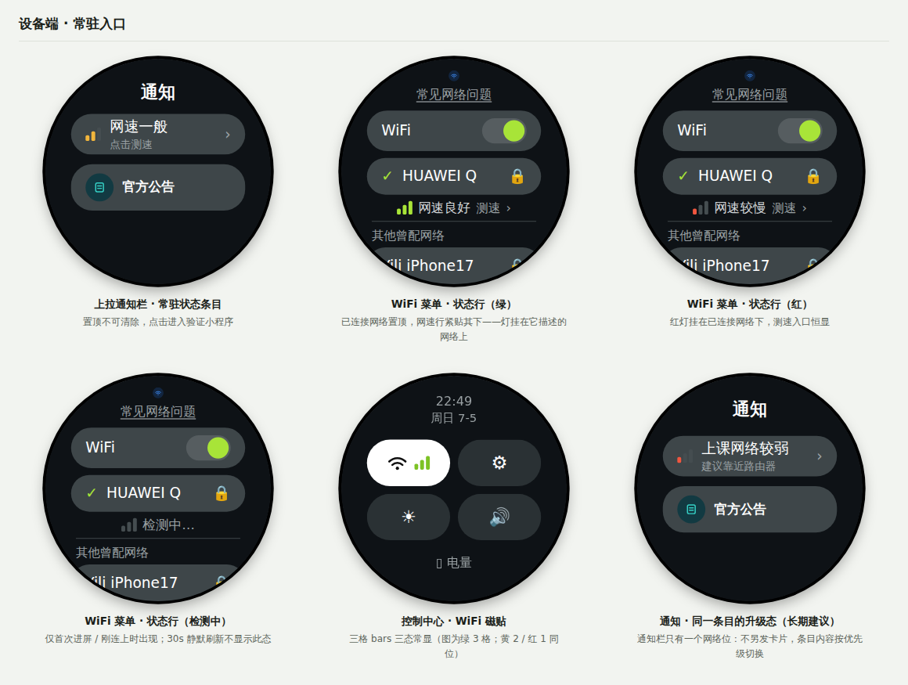
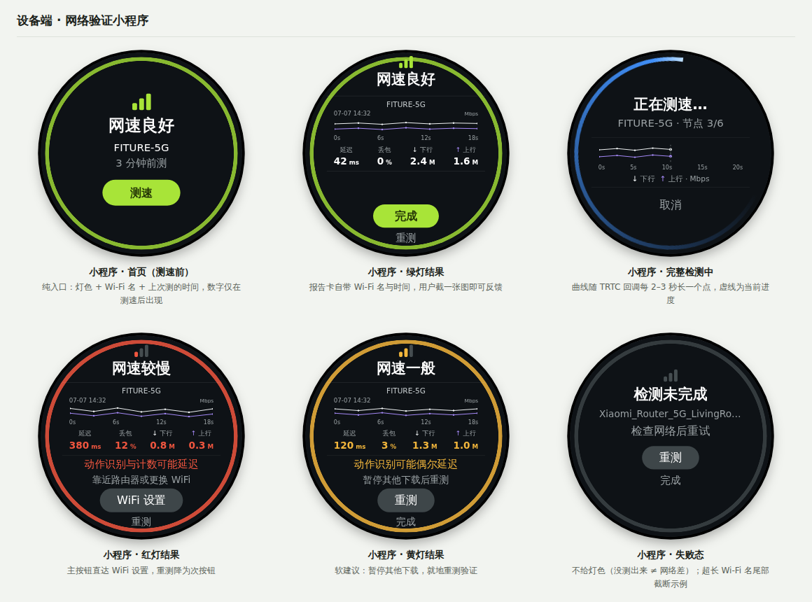
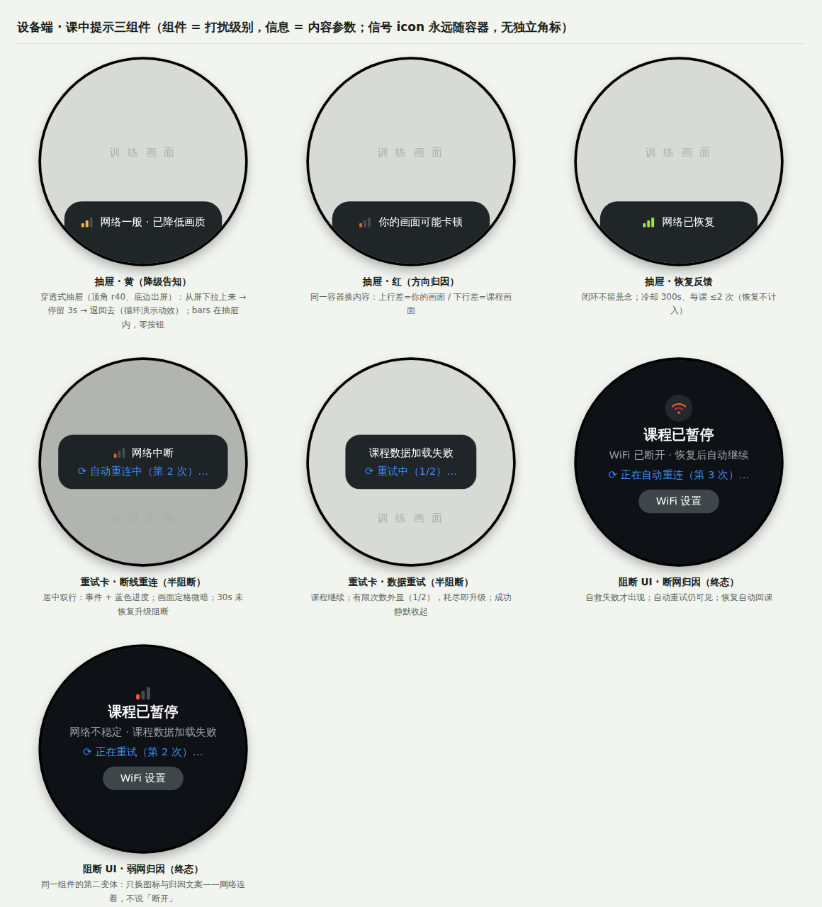
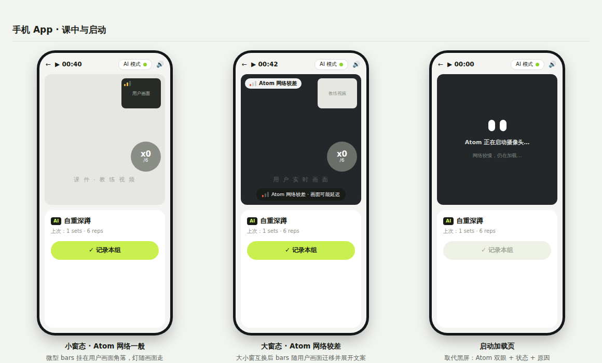

# PRD · atom 网络状态检测与信号同步

> 副题：弱网可感知、可验证、可行动——红绿灯状态机 + 网速测试小程序 + 课中提示收敛

| 项 | 内容 |
| --- | --- |
| 版本 | V1.0（结构化重排版，内容承接 V0.22，含 2026-07-07 会议决议） |
| 日期 | 2026-07-07 |
| 状态 | 评审中 |
| 涉及端 | ATOM 设备（466×466 圆屏）· 手机 App · 云端上报服务 |

**配套文件**（均在仓库根目录，见 README）：

- [`Demo-界面交互UI设计.html`](./Demo-界面交互UI设计.html)——全部界面示意图，可直接打开演示，支持中 / EN 切换
- [`backup/决策参考与迭代过程.html`](./backup/决策参考与迭代过程.html)——历史思考过程归档（不启用，结论以本 PRD 为准）
- [`参考代码-网络检测状态机.c`](./参考代码-网络检测状态机.c)——检测调度 / 状态机 / TRTC 接线的 C 参考实现

> 本文档内嵌的截图取自 Demo 文件，如有出入以 Demo 为准。

---

## 1. 背景与问题

ATOM 是一台通过 WiFi 联网的嵌入式训练设备，上课时通过 TRTC 进行实时音视频互动（含摄像头画面上行）。当前用户反馈的核心问题：**设备已连上 WiFi，但上课时仍然卡顿**。

- 「已连接 WiFi」≠「网络够用」。信号衰减、家庭宽带上行不足、路由器负载等都会导致卡顿，但设备目前对用户只呈现「已连接」一种状态；
- 用户卡顿时无法归因，默认判定为「阿童木做得卡」，产生客诉；客服排查也缺少依据；
- ATOM 是固定摆放设备，信号好坏在摆放时即已决定，但用户没有任何工具能发现「摆放位置信号弱」这一问题。

### 1.1 现有机制及其问题

设备目前已有若干网络慢 / 异常提示，但全部是**课中真的出了问题之后**才触发的弹窗，且部分弹窗需要用户手动点击确认才能关闭。**现状触发逻辑（工程确认，2026-07-07）**：① 请求后端接口连续 3 次超时；② TRTC SDK 回调网络差——两种信号共用同一个阻断弹窗。三个问题：

- **时机太晚**：提示出现时体验已经受损，用户没有任何机会在课前预防；
- **形式太重**：阻断式弹窗遮挡训练画面，把「网络卡」升级成「课被打断」；
- **操作不可行**：用户正在做训练动作、距屏幕较远，要求手动点确认基本等于强制中断训练。

> 因此本方案不只是「新增红绿灯」，同时要**收敛存量课中弹窗**：把网络提醒从「课中事后打断」改造为「课前可预防、课中不打断」。

## 2. 目标与非目标

### 2.1 目标

- **可感知**：用户在任意时刻都能一眼看到当前网络对上课「够不够用」（红绿灯三档）；
- **可验证**：用户可以主动发起一次网速测试，获得针对上课链路的真实测速报告（可截图反馈）；
- **可行动**：网络差时给出可执行建议（靠近路由器 / 更换 WiFi / 重测），而非只报忧；
- **不打断**：课中网络提示全部改为非阻断、自动消失、零操作；需手动确认的弱网弹窗全部移除；
- **可归因**：质量数据上报云端，支撑客服排查与阈值校准，降低网络类客诉。

### 2.2 非目标

- 不承诺「解决」用户的网络问题（宽带质量不在我们控制内），本期解决的是感知、归因与引导；
- 不做持续带宽测速（会挤占上课带宽）；不做路由器侧诊断与配置；
- 课中自适应降级（流畅优先、音频优先）依赖 TRTC 既有能力，只要求正确配置并在文案中告知用户；
- Record / Log 模式的推流与 SD 卡存储策略另行文档（会议 2026-07-07 已单独立项）。

## 3. 方案总览

一套「红绿灯」状态机 + 一个网速测试小程序，四个触点触达；三个模块可独立开发：

- **模块 A · 界面显示**：WiFi 列表页、WiFi 快捷看板（控制中心）、上拉通知栏、网速测试小程序；
- **模块 B · 检测逻辑**：所有界面共用的统一检测调度、测速实现、阈值与上报；
- **模块 C · 课中提示**：设备端 + 手机端的课中呈现与存量弹窗收敛（可单独分期）。

### 3.1 灯的三态定义（字形：三格 bars）

| 档位 | 含义 | 行为 |
| --- | --- | --- |
| 绿 · 网速良好（3 格） | 上课体验预计流畅 | 静默显示，不打扰用户 |
| 黄 · 网速一般（2 格） | 可以上课，可能偶尔卡顿 | 课中触发流畅优先降级并轻提示 |
| 红 · 网速较慢（1 格） | 上课大概率卡顿 | 提示并给出可执行建议 |

统一字形为三格阶梯 bars：**3 格绿 / 2 格黄 / 1 格红，全暗 = 检测中**。理由：① 格数 + 颜色双通道编码，色盲 / 强光 / 小尺寸可读；② 阶梯形与 WiFi 扇形（= 本地信号强度，用于网络详情页）明确区分——**扇形管信号，阶梯管网速**，两个概念两个字形；③ 圆点被否决：与「录制中 🔴」红点语义冲突（摄像头设备上致命歧义）。论证见 [`backup/决策参考与迭代过程.html`](./backup/决策参考与迭代过程.html) Part 2。

**文案词族**：测速场景用「网速」（状态行 / 通知栏 / 小程序——快慢问题）；连接场景用「网络」（课中中断 / 重连 / 恢复——通断问题）。

### 3.2 与现状对照

| 维度 | 现状 | 本方案 |
| --- | --- | --- |
| 触发时机 | 课中已经出问题才提示 | 常驻可见 + 课前可验证 + 课中实时 |
| 提示形式 | 阻断式弹窗，遮挡训练画面 | 常驻灯色 / 角标 / 自动消失 toast |
| 用户操作 | 部分需手动点击确认 | 零操作；仅「需用户决策」的场景保留弹窗 |
| 问题定位 | 无归因，只报「网络异常」 | 分段归因（设备→路由器 / 宽带→公网）+ 可执行建议 |

---

## 4. 模块 A · 界面显示

> 各显示位置共享模块 B 的同一状态机与数据，任何入口灯色一致。完整可演示版见 [`Demo-界面交互UI设计.html`](./Demo-界面交互UI设计.html)。

### A1 WiFi 列表页（原 F2.2–F2.7）

- **A1.1 状态行锚定已连接网络**：已连接网络自动置顶到 WiFi 开关正下方（iOS 式动态排序），**网速状态行紧贴其下**——灯挂在它描述的网络上，位置即语义（与手机端「灯随用户画面」同一原则）；其余曾配网络归入分隔线下「其他曾配网络」分组。样式：三格 bars（灯色）+ 网速状态 + 弱化灰色「测速 ›」，无卡片底。文案三态：**网速良好 / 网速一般 / 网速较慢**；「测速 ›」三态恒显（本页唯一测速入口，恒显保证可发现性）。位置三方案对比见 [`backup/决策参考与迭代过程.html`](./backup/决策参考与迭代过程.html) Part 1；
- **A1.2 热区**：状态行整行为点击热区（高度 ≥ 60px），点击进入网速测试小程序（A4）；
- **A1.3 状态联动**：WiFi 关闭或未连接 → 无已连接行，状态行不显示（未连接由列表自身表达）；连接中 → 在对应网络行内显示「连接中…」；已连接但暂无有效数据（首次进屏 / 刚连上 / 缓存过期）→ 三格全暗 +「检测中…」；有数据 → 三色。**后台 30 秒静默刷新原地更新，不显示任何「刷新中」加载态**（避免每半分钟闪一次）；
- **A1.4 连接流程系统逻辑（开发对接）**：(a) 开启 WiFi → 扫描状态；(b) 扫描完成 → 自动从「曾配对网络」择优连接；(c) 连接成功 → 列表轻刷新动效：已连接网络上浮置顶，其下方跟上网速状态行（先「检测中…」后三色）；
- **A1.5 头部文字（开发对接）**：图标下方无效的「WiFi」标题改为**「常见网络问题」**，整行可点击 → 连接帮助 tips 页。

### A2 WiFi 快捷看板（控制中心磁贴，原 F2.1 / F2.5）

- **A2.1** 黄 / 红时在磁贴内 WiFi 图标右侧显示小型三格 bars（2 格黄 / 1 格红）；绿灯不显示，图标回中（不给正常状态加噪音）。**决策记录**：不用图标弧格填充度表达质量（弧格 = 信号强度语义，「信号满格但宽带拥塞」时必然误导）；不用图标染色（与开关语义打架）；不用角标圆点（与全系统 bars 不一致 + 17px 过小 + 录制红点歧义）；
- **A2.2** 系统状态栏若展示 WiFi 图标，黄 / 红时同步染色（与磁贴同一状态机）。

### A3 上拉通知栏（原 F1 + F7.5 / F5.3 通知）

- **A3.1** 顶部常驻网络状态条目，位于所有通知之上、不可清除：bars + 结论 + 引导语（黄「网速一般 · 点击测速」/ 红「网速较慢 · 点击查看建议」/ 绿「网速良好」）；展开通知栏时立即触发一次刷新；点击进入小程序（A4）；
- **A3.2** 课中不弹通知栏提醒（课中提醒由模块 C 负责，避免双重打扰）；
- **A3.3 弱网通知（两级）**：短期——同一 WiFi 连续 3 次采样黄 / 红 → 推「当前 WiFi 网速较弱，可能影响上课」（每 WiFi 每天最多一次）；长期——连续 3 天课中红灯累计超阈值 → 推「建议将 Atom 靠近路由器」（7 天内不重复）。绿灯永不主动提示。

### A4 网速测试小程序（原 F3）

**状态机**：首页 →「测速」→ 检测中（可取消）→ 按官方 `quality` 进入绿 / 黄 / 红结果页；失败 → 失败态。结果页「重测」直接回到检测中。

- **A4.1 首页 = 纯入口（测速前）**：灯色 bars + 一句话结论 + **当前 Wi-Fi 名（SSID）** + 副行数据时效（「刚刚更新」≤60 秒 /「N 分钟前测」≤5 分钟）+ 主按钮「测速」。SSID 必须外显——用户点进来看「网好不好」时往往不知道自己连的是哪个 WiFi，灯色结论必须挂在具体网络名下才可归因（与 B2 按 SSID 缓存一致）。**不展示任何数字指标**——常驻探测没有真实带宽，数字只在测速后出现，「测速前 = 入口、测速后 = 报告」天然可区分；缓存超 5 分钟不显示旧灯色，直接「检测中…」并刷新；
- **A4.2 检测中**：标题「正在测速…」+ 副行「Wi-Fi: {SSID} · 节点 N / M」（按官方回调驱动，不做假进度）+ 报告卡内波形实时生长（↓ 灰白 = 下行、↑ 紫 = 上行，见 A4.7）+「取消」（调用 `stopSpeedTest`）；按钮防重入（官方限制同一时间仅一个测速任务）；
- **A4.3 结果页信息分组（四组，组间距 > 组内距）**：① 结论（bars + 一句话）→ ② **报告卡**，卡内自上而下：**表头两行——第 1 行 SSID（超长截断）、第 2 行日期时间（独占一行，永不被 SSID 挤掉）**，不加「Wi-Fi:」前缀（上下文已明确，标签属冗余；带日期是为了反馈截图能和后端日志对上，方便 debug）→ 波形定格 + 时间轴（表头第二行两端对齐：**日期时间靠左、单位「Mbps」靠右**——曲线纵轴 = 上下行带宽，不占额外行高；检测中页无表头，单位并入图例行「↓ 下行 ↑ 上行 · Mbps」）→ 四指标一行：延迟 / 丢包 / ↓ 下行 / ↑ 上行，**标签在上、数值在下**（对比过数值在上的方案：标签在上阅读顺序自然「先知道是什么再看多少」、↓↑ 箭头更靠近它解释的曲线、卡片底边收在加粗数值上更稳，与 Ookla 等主流测速工具一致；标签带曲线同色箭头；-1 显示「—」；着色标准见下表）→ ③ 影响 + 建议（仅黄 / 红；**各固定一行，字数预算：中文 ≤ 14 全角、EN ≤ 30 字符**——这两处是我们自己维护的固定文案集而非动态内容，靠文案表管控长度即可；**不采用跑马灯**：滚动文字在 1–2 米观看距离难读，且截图会截到半句话，破坏「截图即报告」）→ ④ 操作。**影响 / 建议 + 按钮组成固定高度的操作区，主按钮与次按钮的位置在绿 / 黄 / 红 / 失败四态间完全一致**（绿灯无影响建议时留空占位）——重测循环里按钮不位移，防误触、建立肌肉记忆。**一张报告卡 = 一份完整测速报告，截图即可反馈客服**（截图给人看，上报给系统看）。稳定性派生标签：样本方差超阈值时卡下方显示「网络波动较大」。

  **指标着色标准**（阈值与模块 B4 同源、OTA 可调；数值默认白色，超阈值才变色）：

  | 指标 | 默认（白） | 黄 | 红 |
  | --- | --- | --- | --- |
  | 延迟 RTT | ≤ 50 ms | 50–150 ms | > 150 ms |
  | 丢包率 | < 2% | 2–8% | > 8% |
  | ↓ 下行 | ≥ 期望 2.0 Mbps | 期望的 60–100%（1.2–2.0M） | < 60%（< 1.2M） |
  | ↑ 上行 | ≥ 期望 1.5 Mbps | 期望的 60–100%（0.9–1.5M） | < 60%（< 0.9M） |

  每个指标**独立**按自己的阈值着色；整页灯色结论仍以 TRTC `quality` 为准，两者允许不一致（如整体黄灯但上行单项标红）——着色的作用是让用户一眼看出**卡在哪一项**；
- **A4.4 按钮逻辑（主按钮 = 最短解决路径）**：

| 状态 | 主按钮 | 次按钮 | 理由 |
| --- | --- | --- | --- |
| 首页 | 测速 | — | 本页唯一动作 |
| 检测中 | — | 取消 | 等待可中止 |
| 结果 · 绿 | 完成（退出） | 重测 | 没问题最短路径是离开；存疑可就地复测 |
| 结果 · 黄 | 重测 | 完成 | 建议是软动作（暂停下载），做完就地验证 |
| 结果 · 红 | WiFi 设置 | 重测 | 建议是硬动作（换网 / 挪设备）；什么都不改就重测结果不会变 |
| 失败态 | 重测 | 完成 | 任务未完成，重试是唯一有效动作 |

- **A4.5 失败态**：`success = false` 时**不给任何灯色**（没测出来 ≠ 网络差），「检测未完成 / 检查网络后重试」；`errMsg` 仅上报不上屏；
- **A4.6 历史与精简**：结果本地存近 10 次（按 SSID 分组）并上报；小程序内「历史记录」次级入口（P2）；各页面移除顶部时钟（与检测任务无关的信息不上屏）；
- **A4.7 波形图规范（时间密度 · 实时刷新 · 配色）**：
  - **配色**：↓ 下行 = 灰白 `#F2F5F6`、↑ 上行 = 紫色 `#A78BFA`，图例与指标标签带同色箭头（箭头 ↓↑ + 下行在前是唯一通用的行业惯例，颜色各家自定）。灰白 + 紫只占一个色相位、区分度高；曲线**禁用红 / 黄 / 绿**——三色已被红绿灯语义占用，曲线用灯色会造成「上行 = 绿灯」的误读（V1.0 前的稿子恰好踩过这个坑）；
  - **分隔线而非容器**：报告卡不加底色容器，改用**上下各一条 1px 细分隔线**（白 10% 不透明度）在纯黑背景上界定报告区——圆屏面积小，整块浅色底框显碎，细线既分组又不添料；
  - **笔触**：折线线宽约 1.5px、样本点 r ≈ 2px、最新点 r ≈ 3px——466 圆屏物理尺寸小，线过粗会显粗糙；屏缘状态色环宽度约 10px，只作氛围提示不承载数据，过宽挤占内容区；
  - **时长逻辑（非固定，Demo 的 18s / 20s 仅为示例值）**：总时长 = 延迟丢包阶段（约 5 秒）+ 带宽阶段，主要由**测速节点数**（`totalCount`，服务端下发、非我们指定）和网络状况决定，典型 **10–30 秒**。注意方向性：**网快不会明显更快**（时长下限由节点调度节奏决定），**网差会拖长**（等待、重试、丢包补偿）——所以进度环按 `finishedCount / totalCount` 驱动而不是按时间，永远真实；**硬超时 40 秒**：超时调用 `stopSpeedTest` 进失败态，文案「检测超时 / 检查网络后重测」。备选文件测速路径时长反而可控：固定时间窗（下行 8s + 上行 8s + ping ≈ 2s，共约 18 秒恒定），这是自研路径的一个优点；
  - **时间密度**：一个样本点 = 一次 TRTC `onSpeedTestResult` 进度回调，官方节奏约每 2–3 秒一点，共约 5–8 点；备选文件测速路径按 1 秒一个吞吐量桶采样（约 15–30 点）。点即真实样本，**只画折线不做平滑插值**（不虚构数据），且**每个样本位置画一个小圆点**（r ≈ 2px）——点标出「哪一刻真的回传过数据」，线只负责连接；
  - **实时刷新**：检测中每收到一个回调就在曲线右端追加一点（可 300ms 缓动画入），**最新一点放大显示**（r ≈ 4px，标记「刚回传」），x 轴 = 已用时长，**检测中用预估总时长定标**（初始 20 秒 = `totalCount` × 近期平均每节点耗时；实际超出预估时轴右端整体扩展并重划刻度，曲线不打断），虚线游标标记当前进度；**结果页 x 轴 = 本次实际耗时**（如实际 14 秒就标到 14s，不凑整到假的 18s）；**波形下沿标注时间轴：4–5 个真实秒数刻度**（示例：结果页 `0s / 6s / 12s / 18s`，检测中 `0s / 5s / 10s / 15s / 20s`），采样点落在刻度尺上，用户能读出「掉速发生在第几秒」。**决策记录**：逐点标秒数太挤（5–8 点 × 每标签约 24px，330px 宽放不下且噪）；只写「每点 ≈ 2–3 秒」信息量不足（读不出事件位置）；均匀秒数刻度两者兼顾——采样间隔属工程参数，写在本 PRD 与上报字段里，不上屏；回调间隔内数值不做假动画。带宽值在延迟阶段尚无效（-1），曲线从首个有效带宽样本开始画；
  - **定格复用**：测速结束波形数据原样冻结进结果页报告卡（同一份数据、同一组件），不重绘不重采样；
  - **字号层级**（466px 屏基准，自大到小）：结论标题 34 > 影响 24 > 指标数值 22 > 表头 SSID/时间 17 > 指标标签 15 > 时间轴 13——结论是第一眼信息、影响其次，测速数字是佐证细节；正文/按钮 26；组间距大于组内距，宁可留白也不顶到表圈。
- **A4.8 边界 · 空态 · 显示保护**（Demo 失败态屏含超长 SSID 截断示例）：

| 场景 | 处理 |
| --- | --- |
| **超长 SSID**（中文 / emoji / 32 字节长名） | 表头两行制：SSID 独占第 1 行、超宽尾部省略号（可用满卡宽约 19 半角字符）；日期时间独立第 2 行，**任何情况下完整可见**；首页 / 检测中 / WiFi 列表行同规则 |
| 隐藏 SSID / 名称为空 | 显示占位「已连接网络」 |
| **从未测过速**（新机 / 恢复出厂） | 首页三格全暗 +「尚未测速」，不显示时效行；主按钮「测速」不变 |
| **未连接 WiFi 进入小程序** | 「未连接 WiFi」+ 主按钮「WiFi 设置」，隐藏测速按钮（测了也没有意义） |
| **课程进行中**（B1 课中互斥） | 测速入口置灰 + 副行「课程中暂不可测速」；不弹窗 |
| 测速中 WiFi 断开 / 切换网络 | 立即取消任务进失败态，副行注明「网络已断开 / 已切换网络」；切换后按 B2 清缓存重新探测 |
| **测速超时**（> 40 秒未完成） | 调用 `stopSpeedTest` 进失败态，「检测超时 / 检查网络后重测」；已回传的样本随上报带出（半份数据对排查也有价值） |
| 带宽返回 -1（官方无效值） | 指标显示「—」，不着色、不参与波形 |
| 延迟极端值 | > 999 ms 显示「999+ ms」；丢包封顶 100% |
| 大带宽数值 | < 10 Mbps 保留 1 位小数，≥ 10 Mbps 取整（如「88 M」）；四指标用等宽数字（tabular figures），刷新不跳动 |
| 波形样本 < 3 点（提前中断 / 极端快） | 只画采样点不连线；不出「网络波动较大」派生标签（样本不足不下结论） |
| 设备时钟未同步 | 表头时间显示「时间未同步」，上报侧改用相对时间戳，避免假日期误导 debug |

---

## 5. 模块 B · 检测逻辑（统一）

### B1 数据源分工

| 场景 | 数据源 | 频率 | 流量成本 |
| --- | --- | --- | --- |
| **常驻**（A1–A3 全部界面） | 系统 RSSI + 轻探测 | 见 B2 调度表 | 约 35 KB / 小时 |
| **主动测速**（A4 小程序） | TRTC `startSpeedTest`（备选：自研文件测速） | 用户触发，典型 10–30 秒（非固定，见 A4.7 时长逻辑；硬超时 40 秒） | 少量真实测速流量；**课中禁止** |
| **课中**（模块 C） | TRTC `onNetworkQuality` + `onStatistics` | SDK 每 2 秒回调 | 零（复用业务流量） |

> 原则：**不为了检测而挤占上课带宽**。**轻探测**定义：向网关与自家服务器各发数个 ping 包，仅测 RTT / 丢包、不测带宽；单轮约 0.2 KB，30 秒一轮 ≈ 35 KB / 小时（不足一张表情图），与完整测速（单次数 MB）是两个量级。

### B2 采样调度与数据时效（原 F7，会议 2026-07-07 对齐）

| 时机 | 动作 |
| --- | --- |
| 首次配网成功 | 静默采样一次（顺带摆放位置预警） |
| 开机完成 / 休眠唤醒 | 采样一次 |
| 亮屏交互态 | 每 30 秒轻探测（周期 OTA 可调） |
| 桌面常亮态（时钟 / 待机画面） | 每 60 分钟一次（OTA 可调 30–120 分钟） |
| WiFi 切换 / 重连（SSID 变化） | **立即采样 + 清空旧网络缓存——灯色不跨 WiFi 继承**，新样本前显示「检测中…」 |
| 进课前 | 不做完整测速、不阻塞进课；可选一次非阻塞轻探测（缺席不影响：进房后 `onNetworkQuality` 数秒内接管） |
| 熄屏 / 深睡 | **不采样**——不为测网唤醒设备，续航优先 |

- **时效规则**：样本带时间戳，新鲜窗口 5 分钟；过期样本不外显灯色（显示「检测中…」并刷新）——宁可短暂灰色，不用旧结论冒充现状；
- **时效外显只在小程序首页**：其他入口只在亮屏时可见，而亮屏时数据必然 ≤30 秒旧，「看得见即新鲜」，时间戳冗余。

### B3 完整测速实现（TRTC 官方对齐）

调用参数（`startSpeedTest` / `TRTCSpeedTestParams`）：

| 参数 | 取值 | 依据 |
| --- | --- | --- |
| `scene` | delayAndBandwidthTesting（延迟 + 带宽双测） | 波形与「上行流畅」判定需要带宽预测 |
| `expectedUpBandwidth` | **1500 kbps**（范围 10–5000） | Atom 上行 720p@15fps 推荐码率 1200 kbps + 25% 余量 |
| `expectedDownBandwidth` | **2000 kbps** | 下行课件 / 教练视频 720p + 余量 |
| `sdkAppId / userId / userSig` | 复用业务账号体系 | 官方必填 |

结果字段 → UI 映射（`TRTCSpeedTestResult`）：

| 字段 | 单位 / 范围 | UI |
| --- | --- | --- |
| `quality` | TRTCQuality 1–6 | **灯色直接采用官方综合评分**：1–2 绿 / 3–4 黄 / 5–6 红（与课中同一映射） |
| `rtt` | ms | 「延迟」 |
| `upLostRate / downLostRate` | 0–1.0 | 「丢包」= 较大值 ×100% |
| `availableUp/DownBandwidth` | kbps，-1 无效 | 「上行 / 下行」数值；≥ 期望 → 正常色，不足 → 灯色着色，-1 →「—」 |
| `success / errMsg` | — | 失败态；errMsg 仅上报 |
| `ip` | — | 不上屏，随上报（客服排查节点） |

- 进度：按节点每 2–3 秒回调一个样本，整次典型 10–30 秒、随节点数与网络状况浮动（时长逻辑与 40 秒硬超时见 A4.7），环形进度按 `finishedCount / totalCount` 真实驱动；波形逐点绘制（约 5–8 点）；
- 官方约束互证：仅进房前调用（= 课中互斥）；同一时间仅一个任务（按钮防重入）；产生少量基础服务费（仅用户触发）；
- 附加收益：测速结果用于 SDK 后续**选路优化**——可在 tips 页告知「测速还能改善上课线路」；
- **实现路径（会议 2026-07-07）**：`startSpeedTest` 非课中可用性待工程实测（官方定位即「进房前测速」）；**备选**：自研文件测速（对自家服务器上传 + 下载测试文件、数秒多次采样，参考 PC 教练端实现，找张恒），灯色改用 B4 本地阈值。**两种实现共用同一套 UI / 状态机 / 文案**。

### B4 阈值与防抖（首发值，OTA 可调）

| 灯色 | 课中（TRTC quality） | 常驻（RSSI） | 常驻（RTT / 丢包） |
| --- | --- | --- | --- |
| 绿 | 1–2 | > −60 dBm | RTT < 50 ms 且丢包 < 2% |
| 黄 | 3–4 | −60 ~ −70 dBm | RTT 50–150 ms 或丢包 2–8% |
| 红 | 5–6 | < −70 dBm | RTT > 150 ms 或丢包 > 8% |

- 多指标取**较差者**；防抖：连续 3 个采样周期同级才切灯（课中约 6 秒，常驻约 90 秒）；
- 归因探测：同时 ping 网关与自家服务器——网关差 = 设备→路由器段弱（挪位置）；网关好服务器差 = 宽带 / 公网弱（换网 / 错峰）。

### B5 数据上报（原 F5）

- 常驻按小时聚合（RSSI 分布、网关 / 服务器 RTT）；课中按会话聚合（灯色时长占比、丢包 / RTT、降级次数）；完整测速逐次上报；手机端指标同会话关联——客服可看「卡顿时弱的是哪一端」；
- 客服后台按设备查近 7 天时间线，三类归因（设备→路由器 / 宽带 / 服务端）；
- 阈值全部支持云端下发 / OTA，首发保守，用上报数据校准。

---

## 6. 模块 C · 课中提示（独立模块，可分期开发）

> 会议 2026-07-07 明确课中与模块 A / B 解耦，可下一期实施；其中 C3 带宽保护**可立即执行**。

### C0 现状与原则

现状：后端接口连续 3 次超时或 TRTC 回调差 → 同一个阻断弹窗「网络连接不稳定，请重试」，需手动确认。原则（已拉齐）：**除非真的断了，不打断用户**；识别的实时性优先于一切后台任务。

### C1 设备端角标与提示（原 F4.1–F4.5 / F4.7）

- 课中以 `onNetworkQuality` 为唯一灯色数据源（上下行取较差者）；绿灯角标完全隐藏，黄 / 红在屏幕顶部显示 bars 角标；
- 灯色下降 toast 一次，文案区分方向：上行差「网络较差 · 你的画面可能卡顿」/ 下行差「网络较差 · 课程画面可能卡顿」/ 黄「网络一般 · 已降低画质」；冷却 5 分钟，每节课最多 2 次；恢复静默变绿；
- TRTC 降级配置核查：流畅优先、音频优先兜底、上行编码留余量（720p）；
- 提示可感知性：黄 / 红提示配短音效或语音播报（用户在动作中看不到屏幕），可设置关闭；
- `onStatistics` 明细聚合上报，不上屏。

### C2 存量弹窗收敛（原 F4-R / F4.6）

收敛决策树（替代所有存量网络弹窗）：

| 情况 | 处理 | 用户操作 |
| --- | --- | --- |
| 瞬时抖动（<10 秒自愈） | 不打扰，最多黄灯角标 | 无 |
| 中断、自动重连中 | 非阻断横幅「网络中断 · 正在自动重连…」，画面定格 | 无 |
| 重连超时 / WiFi 断开（>30 秒） | 全屏中断页（唯一保留的阻断样式）：归因 + 自动重试可见 | 仅「WiFi 设置」 |
| 恢复 | toast「网络已恢复」自动消失 | 无 |

文案四段式：标题 = 发生了什么；正文 = 影响 + 归因；辅助行 = 系统正在做什么（「正在自动重连（第 N 次）…」）；按钮 = 只放用户才能做的事。**「重试」「OK」类按钮全部移除**——重试是机器的活。

### C3 课中带宽保护（会议决议，可立即执行）

课中实时 AI 识别期间**暂停一切后台大文件上传**（组间报告 720p 视频等）；set 结束 / 休息期尝试上传；重新进课即**取消排队上传**（当前文件传完即止；断点续传后续版本）；组间报告界面写明「视频上传 / 解析中，稍后或课后回看」，不承诺练完即看。

### C4 手机 App 课中（原 F6.1–F6.6）

- 同一套灯色语义与冷却规则；数据源为手机端 TRTC 回调（`localQuality` 判手机侧、远端流统计判 Atom 侧）；
- **灯随用户画面走（空间归因）**：网络 bars 永远锚定用户实时画面窗口（Atom 摄像头回传流）——小窗时微型 bars 挂画中画角落，大小窗互换后随画面迁移到主窗并展开「bars + 文案」。默认语义 = 用户画面背后 Atom 的网络；**手机侧弱网不挂窗口**，用页面级 toast「手机网络较差 · 建议更换网络」——灯挂在哪路画面上，说的就是那路流的网络，位置即归因；
- 远端画面断流 / 加载超 3 秒：窗口内归因占位「画面加载中 · Atom 网络较差」，**禁止无解释的无限转圈**；
- 断线重连遵循 C2 决策树；「记录本组」等操作断网时本地缓存、恢复自动同步；
- 手机端指标并入 B5 上报。

### C5 启动加载页（原 F6.7）

进课时用户画面窗口以分阶段状态提示取代黑屏：「正在连接 Atom…」→「Atom 正在启动摄像头…」→ 出画面；任一阶段超 5 秒追加原因行「网络较慢，仍在加载…」；失败进入 C2 决策树。加载标识用 Atom 双眼形象。原则：**任何等待都必须告知系统正在做什么**。

---

## 7. 状态文案表（双语）

文案原则：一行说清，状态在前、动作在后；英文不重复灯已表达的信息，按钮用单词，统一 "Wi-Fi" 拼写。

| 位置 | 灯色 / 场景 | 中文 | English |
| --- | --- | --- | --- |
| 通知栏条目 | 绿 | 网速良好 | Good speed |
| 通知栏条目 | 黄 | 网速一般 · 点击测速 | Fair speed · Tap to test |
| 通知栏条目 | 红 | 网速较慢 · 点击查看建议 | Slow speed · See tips |
| 通知栏条目 | 灰（未连接） | 未连接网络 | Not connected |
| WiFi 页状态行 | 绿 / 黄 / 红 | 网速良好 / 一般 / 较慢 + 测速 › | Good / Fair / Slow · Speed test › |
| WiFi 页状态行 | 未连接 / 关闭 | 状态行不显示 | — |
| WiFi 页状态行 | 连接中 | 显示于网络行内：连接中… | Connecting… |
| WiFi 页状态行 | 检测中（无有效数据） | 检测中… | Testing… |
| 小程序首页 | 副行（时效） | 刚刚测过 / 3 分钟前测 | Tested just now / Tested 3 min ago |
| 小程序首页 | 主按钮 | 测速 | Speed test |
| 小程序检测中 | 进度 / 图例 | Wi-Fi: {SSID} · 节点 3/6；↓ 下行 / ↑ 上行 | Wi-Fi: {SSID} · node 3/6; ↓ Down / ↑ Up |
| 小程序结果 | 绿 / 黄 / 红 | 网速良好 / 网速一般 / 网速较慢 | Good / Fair / Slow speed |
| 小程序结果 | 影响（黄 / 红） | 动作识别可能偶尔延迟 / 动作识别与计数可能延迟 | Pose tracking may lag at times / Tracking & counting may lag |
| 小程序结果 | 建议（路由器弱 / 宽带弱） | 靠近路由器或更换 WiFi / 暂停其他下载后重测 | Move closer or switch Wi-Fi / Pause other downloads, retest |
| 小程序结果 | 波动标签（方差超阈值） | 网络波动较大 | Unstable connection |
| 小程序失败态 | — | 检测未完成 / 检查网络后重试 | Test incomplete / Check network and retry |
| 小程序超时态 | > 40 秒 | 检测超时 / 检查网络后重测 | Test timed out / Check network and retest |
| 小程序按钮 | — | 测速 / 重测 / 完成 / 取消 / WiFi 设置 | Speed test / Retest / Done / Cancel / Wi-Fi Settings |
| 设备课中 toast | 黄 / 红上行 / 红下行 | 网络一般 · 已降低画质 / 网络较差 · 你的画面可能卡顿 / 网络较差 · 课程画面可能卡顿 | Quality reduced / Your video may lag / Class video may lag |
| 课中中断横幅 | 重连中 | 网络中断 · 正在自动重连… | Connection lost · reconnecting… |
| 全屏中断页 | WiFi 断开 | 网络已断开 / 课程已暂停 · WiFi 已断开 / 正在自动重连（第 N 次）… / WiFi 设置 | Wi-Fi disconnected / Class paused / Reconnecting (attempt N)… / Wi-Fi Settings |
| 全屏中断页 | 有 WiFi 无公网 | 网络无法连接 / 课程已暂停 · 已连 WiFi，无法访问互联网 | No internet / Class paused · Wi-Fi connected |
| 恢复 toast | 重连成功 | 网络已恢复 | Back online |
| 手机 App 课中 | 黄 / 红（Atom 侧） | Atom 网络一般 / Atom 网络较差 · 画面可能延迟 | Atom: fair network / Atom video may lag |
| 手机 App 课中 | 红（手机侧） | 手机网络较差 · 建议更换网络 | Phone network weak · switch Wi-Fi |
| 手机 App 课中 | 用户画面断流 | 画面加载中 · Atom 网络较差 | Loading · Atom network weak |
| 启动加载页 | 阶段 1 / 2 / 超时 / 重试 | 正在连接 Atom… / Atom 正在启动摄像头… / 网络较慢，仍在加载… / 正在重连… | Connecting to Atom… / Starting camera… / Slow network · still loading… / Reconnecting… |
| 弱网通知（短期） | 同 WiFi 连续 3 次黄红 | 当前 WiFi 网速较弱，可能影响上课 | Weak Wi-Fi may affect classes |
| 弱网通知（长期） | 连续 3 天课中红灯 | 近期上课网络较弱，建议将 Atom 靠近路由器 | Weak Wi-Fi lately — move Atom closer to your router |

## 8. 埋点与成功指标

- **北极星**：网络类客诉占比下降 ≥ 30%（「卡顿」关键词客诉为基线）；
- 触达：小程序周打开率、各入口点击占比；
- 问题发现：红灯设备占比、收到建议后 7 天内 RSSI 改善比例；
- 体验兜底：课中红灯时长占比环比。

## 9. 依赖与风险

| 项 | 说明 | 应对 |
| --- | --- | --- |
| TRTC 课外测速可用性 | 工程认知与官方文档描述需实测对齐 | 蔡博实测；不可用 → 自研文件测速（参考 PC 教练端，张恒），UI / 状态机不变 |
| 测速抢带宽 | 完整测速消耗真实带宽 | 课中互斥；仅用户触发 |
| 阈值误报 | 误报损耗信任 | 首发保守 + 上报校准 + OTA 下发 |
| 常驻探测功耗 | 轻探测约 35 KB/h，需实测功耗 | 周期 OTA 可调；熄屏不采样 |

## 10. 里程碑

| 阶段 | 范围 | 验收口径 |
| --- | --- | --- |
| **M1**（P0） | 模块 B（检测调度 + 测速实现）+ 模块 A 全部界面 | 各入口灯色一致；测速可用且课中互斥；过期样本不外显灯色 |
| **M2**（P1） | 模块 C：C1 角标 toast、C2 弹窗收敛、C3 带宽保护（可提前）、C4 手机端、C5 启动页 | 课中不再出现需手动确认的弱网弹窗；提示可归因到端；进课无无解释黑屏 |
| **M3**（P2） | B5 上报 + 客服时间线 + 长期弱网通知 + 阈值 OTA + 小程序历史记录 | 客服可按设备归因；阈值云端可调 |
